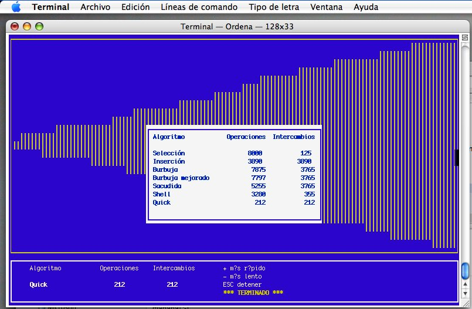

Educational implementation of sorting algorithms 
================================================

Several sorting algorithms implemented in plain C language, with an extensible approach (new algorithms can be connected)
and a simple visualization mechanishm aimed to understand how they work.

The C code is portable to Windows, GNU/Linux and OS X, as the user interface is based on the ncurses library.

The code is documented (in Spanish) with the [doxygen tool](http://www.stack.nl/~dimitri/doxygen/).

Algorithms implemented
----------------------

The algorithms currently implemented are the following:

* Bubble sort - `ordBurbuja()`
* Improved bubble sort - `ordBurbujaMejorado()`
* Selection sort - `ordSeleccion()`
* Insertion sort - `ordInsercion()`
* Shaker sort (also known as cocktail sort) - `ordSacudida()`
* Shell sort - `ordShell()`
* Quick sort - `ordQuick()`

Modules of the project
----------------------

The project is made of the following modules:

* [Definiciones.h](src/Definiciones.h): Definitions of the data types used in the application, such as `boolean` (remember this is pure C, there is not native `boolean` type) or the generic pointer to sorting function `Orderna`

* [Algoritmos.h](src/Algoritmos.h): Contains the prototypes of the functions for each sorting algorithms, whose names are enumerated in the previous section

* [Algoritmos.c](src/Algoritmos.c): Implementation of every sorting function defined in [Algoritmos.h](Algoritmos.h)

* [Interfaz.h](src/Interfaz.h): Prototypes for the functions which are in control of the user interface of the application

* [Interfaz.c](src/Interfaz.c): Implementation of user interface functions using the `ncurses` services

* [Principal.c](src/Principal.c): This is the main entry point to the application. The `algoritmos` array defined at the beginning links the name of each sorting algorithm with the function where it is implemented, allowing the user to chose the algorithms they want to run

* [Makefile](src/Makefile): Simple `make` file to build the application (see the following section)

Compilation
-----------

To compile this program you will need `gcc`, `ncurses` and `make`. A `Makefile` is provided along with the source code. Put all files, including the `Makefile`, in a directory, and type `make` to build the application. This will be the procedure to follow in GNU/Linux or OS X. 

If you use Windows, look for [Cygwin](https://www.cygwin.com/) to obtain the tools you will need. The `curses.h` header file and the `libpdcurses.a` library are included in the `curses` folder of this repository.

How to use the program
----------------------

Once it has been compiled, you can run the program simply typing its name. After the screen that shows the introduction, you can press a key to access the main menu. Using the cursor movement keys, you can select the sorting algorithms you want to run. While a algorithm is running you will see how each element in a random integer array is selected, compared and, if neccesary, interchanged. By means of the `+` and `- ` keys the speed of the process can be increased or reduced. After each sorting algorithm a resume will be shown, as well as at the end of all runnings.

The following snapshots show the program running in GNU/Linux, Windows and OS X, respectively.

The application running in a console window in GNU/Linux

The application running in a console window in Windows

The application running in a console window in OS X

